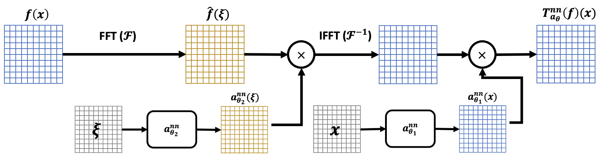

# Pseudo-Differential Integral Operator for Learning Solution Operators ofPartial Differential Equations


## Requirements

The codes in this repositroy were tested using Python 3.9, and Pytorch 1.10 with the cuda 11.3. Use `env.yml` to  install the available environments. 

## Data


Download from google drive https://drive.google.com/drive/folders/1h_5aC9UAUHYAsenICDwee2bANNvXvaI4?usp=sharing. It contains the heat equation, Burgers' equation, Darcy flow, and the Navier Stokes equation data set. In `data/generataion`, it contains the generation code of 1D heat equation using MATLAB R2021b.  For the case of Buregers' equation and the Navier Stokes equation data, we used the same data provided in the repository https://github.com/zongyi-li/fourier_neural_operator. For convenience, only the extension has been changed from the original file. Darcy flow data was regenerated using https://github.com/zongyi-li/fourier_neural_operator/tree/master/data_generation/darcy on grid 512x512.

## Run

Example on the Navier-Stokes with  and the defalut hyperparameters
```
python NS_2d_time.py name_of_experiments --nu 1e-5
```
A pretrained model on the Navier Stokes with  can be loaded by
```
model.load_state_dict(torch.load('pretrained/ns1e-5.bin'))
```
